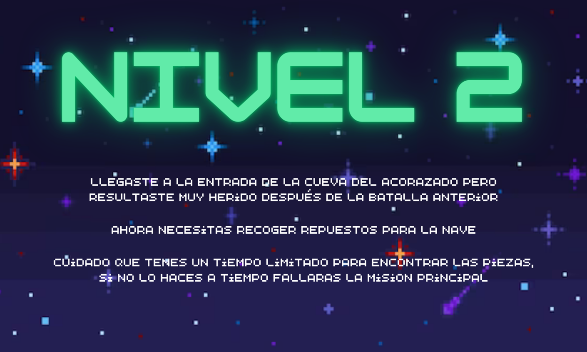

# Dream Team

 

## Equipo de desarrollo: 

- Galdin, Santino 

- Avila,Kevin Thomas 

 

## Capturas:  

Pantalla de inicio del juego.

Pantalla explicativa del nivel 1.

Pantalla explicativa del nivel 2.

Pantalla explicativa del nivel 3.

Una previsualización de la jugabilidad del nivel 1.

Una previsualización de la jugabilidad del nivel 2.

Una previsualización de la jugabilidad del nivel 3.

Pantalla de perdiste del juego.

Pantalla de ganaste del juego.

## Reglas de Juego / Instrucciones: 

<b>General:</b> El jugador manejará una nave espacial con diversos objetivos que varían en cada uno de los niveles. La nave se mueve con las flechas direccionales del teclado y dispara con el espacio. 

La nave tiene dos recursos principales: la nafta, que se gasta cada vez que se mueve, y la munición, que la utiliza para deshacerse de los enemigos. Además, tiene tres vidas por nivel. Si un enemigo choca con la nave, le restará una vida y el jugador pierde si la vida llega a cero. 

Durante el transcurso de los niveles, aparecerán hasta dos tanques de nafta y municiones extra en posiciones aleatorias que el jugador podrá agarrar para superar los objetivos con mayor facilidad. 

<b>Primer nivel:</b> El jugador tendrá que eliminar todos los enemigos para pasar el nivel. Este nivel está diseñado para que el jugador aprenda sobre los controles y el funcionamiento del juego de forma práctica. 

<b>Segundo nivel:</b> El jugador deberá recoger recursos especiales en un lapso de tiempo determinado para pasar el nivel. 

<b>Tercer nivel:</b> En este último nivel, el jugador tendrá que matar al jefe final utilizando los recursos especiales previamente adquiridos mientras maneja sus recursos normales y además esquiva los ataques enemigos. 

## Reglas de Juego / Instrucciones:
<b>Mover:</b> La nave se mueve con las flechas del teclado (flecha para arriba, flecha para abajo, flecha para la derecha, flecha para la izquierda).

<b>Disparar:</b> La nave dispara con la barra espaciadora.

<b>Sonido:</b> Con la tecla "S" vas cambiando el volumen del juego entre nulo, bajo y normal.

<b>Pasar a siguiente pantalla:</b> Con la tecla de enter se pasa a la siguiente pantalla.

<b>Salir al perder/ganar:</b> Con la tecla "q" salis del juego al finalizar.

## Otros:  

Programación con Objetos I – Comisión 1 – Universidad Nacional de Hurlingham 

Versión de Wollok: 3.0.0 

Una vez terminado, no tenemos problemas en que el repositorio sea público 
